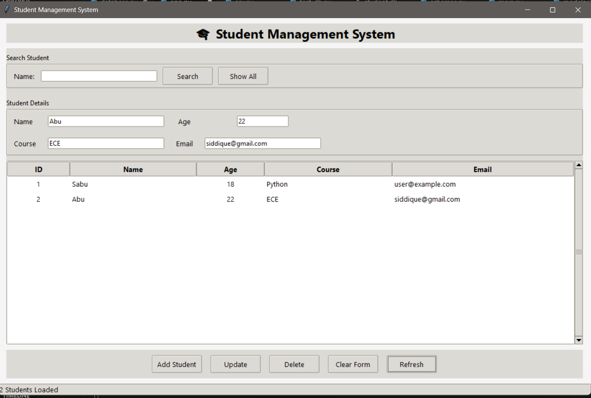
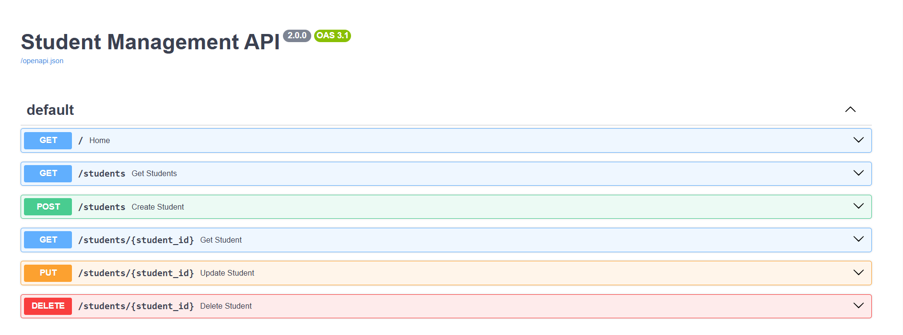
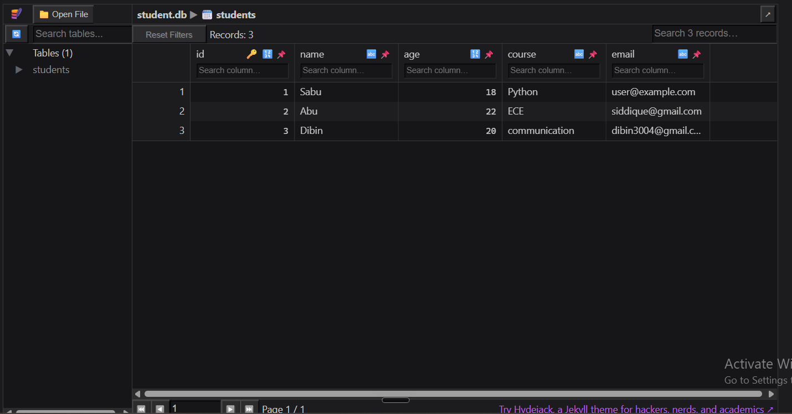

# 🎓 Student Management System

A modern Student Management System built with **FastAPI**, **SQLite**, **SQLAlchemy**, and a **Tkinter Desktop GUI**.
This project demonstrates full-stack Python development by combining a REST API backend with a desktop frontend for complete CRUD (Create, Read, Update, Delete) operations.

---
## 📸 Demo

https://github.com/AboobakerSiddique/Student-Management-System/Screenshots/test.mp4

## 📸 Preview


| GUI | API Docs |
|-----|----------|
|  |  |

---

# ✨ Features

✅ Add Students

✅ View All Students

✅ Update Student Information

✅ Delete Students

✅ Search Students by Name

✅ SQLite Database Storage

✅ SQLAlchemy ORM

✅ REST API using FastAPI

✅ Desktop GUI built with Tkinter

✅ Interactive Swagger Documentation

✅ Input Validation using Pydantic

---

# 🛠 Tech Stack

### Backend

- FastAPI
- SQLAlchemy
- SQLite
- Pydantic
- Uvicorn

### Frontend

- Python
- Tkinter
- ttk Widgets

### Tools

- VS Code
- Git
- GitHub

---

# 📂 Project Structure

```
Student-Management-System/

│
├── StudentAPI/
│   ├── main.py
│   ├── database.py
│   ├── models.py
│   ├── schemas.py
│   ├── crud.py
│   ├── requirements.txt
│   └── student.db
│
├── StudentGUI/
│   ├── app.py
│   ├── api.py
│   └── requirements.txt
│
├── screenshots/
│
├── LICENSE
├── README.md
└── .gitignore
```

---

# ⚙ Installation

## Clone Repository

```bash
git clone https://github.com/AboobakerSiddique/Student-Management-System.git

cd Student-Management-System
```

---

## Create Virtual Environment

```bash
python -m venv .venv
```

Windows

```bash
.venv\Scripts\activate
```

Mac/Linux

```bash
source .venv/bin/activate
```

---

## Install Dependencies

```bash
pip install -r requirements.txt
```

---

# ▶ Run Backend

```bash
uvicorn main:app --reload --port 8001
```

Open

```
http://127.0.0.1:8001/docs
```

---

# ▶ Run Desktop GUI

```bash
python app.py
```

---

# 📌 API Endpoints

| Method | Endpoint | Description |
|---------|----------|-------------|
| GET | /students | Get all students |
| GET | /students/{id} | Get student by ID |
| POST | /students | Add new student |
| PUT | /students/{id} | Update student |
| DELETE | /students/{id} | Delete student |

---

# 📷 Screenshots

## Desktop Application

|  |

---

## Swagger Documentation

|  |

---

## SQLite Database

|  |

---

# 🎯 Learning Outcomes

Through this project I learned:

- REST API Development
- FastAPI Fundamentals
- SQLAlchemy ORM
- SQLite Integration
- CRUD Operations
- Pydantic Validation
- Desktop GUI Development
- API Consumption using Requests
- Project Structuring
- Git & GitHub Workflow

---

# 🚀 Future Improvements

- User Authentication
- Login System
- Export to CSV
- Import from CSV
- Dashboard Analytics
- Pagination
- Docker Support
- Cloud Deployment

---

# 👨‍💻 Author

**Aboobaker Siddique**

GitHub

https://github.com/AboobakerSiddique

LinkedIn

www.linkedin.com/in/aboobaker-siddique-ba4a66333

---

# ⭐ Support

If you found this project useful, consider giving it a ⭐ on GitHub!

It helps and motivates me to build more projects.