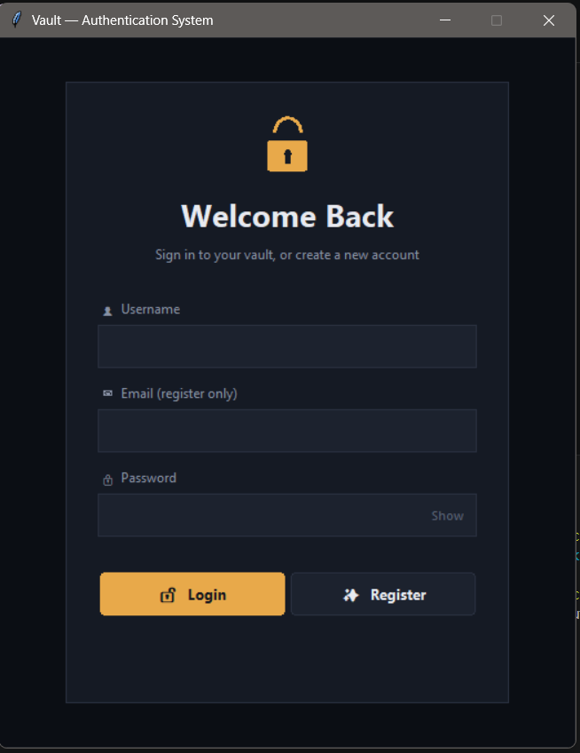
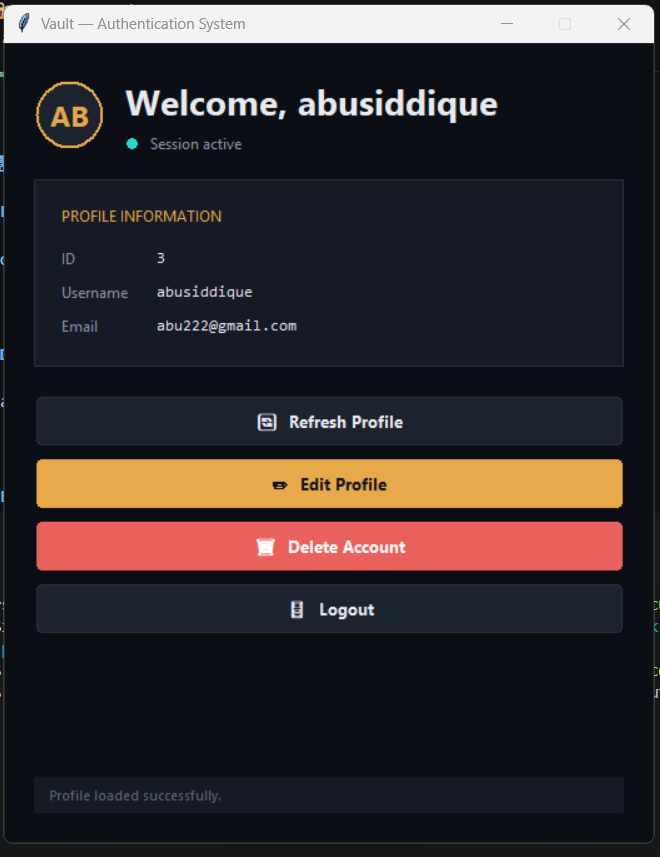
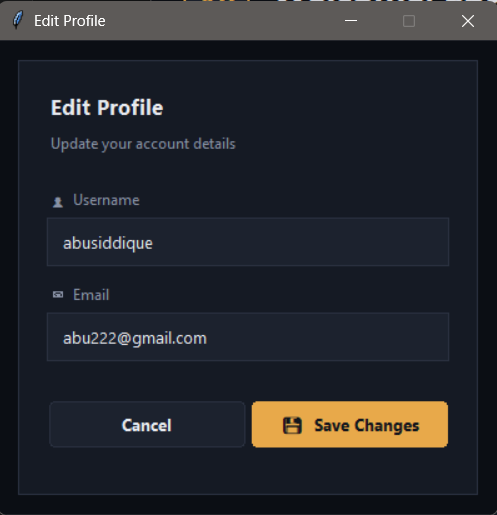

# 🔐 FastAPI Authentication System

A complete **JWT-based Authentication System** built with **FastAPI** and a custom **Tkinter Desktop GUI**.

This project demonstrates how a real authentication system works end-to-end — from user registration and secure password hashing to JWT authentication, protected API routes, database operations, and a desktop client communicating with a REST API.

> 🚀 Built as part of my journey toward becoming an **AI / Backend Developer**.

---

## ✨ Features

### 🔐 Authentication

- ✅ User Registration
- ✅ User Login
- ✅ Secure Password Hashing with bcrypt
- ✅ Password Verification
- ✅ JWT Access Tokens
- ✅ JWT Expiration
- ✅ Protected API Routes
- ✅ Bearer Token Authentication
- ✅ OAuth2PasswordBearer
- ✅ Token-based session handling

### 👤 User Management

- ✅ View Current User
- ✅ Update Profile
- ✅ Delete Account
- ✅ Unique Username Validation
- ✅ Unique Email Validation
- ✅ Request Validation
- ✅ Error Handling

### 🖥️ Desktop GUI

- ✅ Modern Tkinter Interface
- ✅ Login Screen
- ✅ Registration
- ✅ Dashboard
- ✅ Profile View
- ✅ Edit Profile
- ✅ Delete Account
- ✅ Logout
- ✅ API Integration
- ✅ JWT Token Handling
- ✅ Authentication Status Handling

### ⚙️ Configuration & Security

- ✅ Environment Variables
- ✅ `.env` Configuration
- ✅ Secret Key Management
- ✅ JWT Secret Management
- ✅ `.gitignore`
- ✅ Application Logging
- ✅ Production-oriented folder structure
- ✅ Sensitive credentials excluded from Git

---

# 🖥️ Application Preview

## 🔑 Login



---

## 📊 Dashboard



---

## ✏️ Edit Profile



---

# 🎥 Demo

## 📹 Complete Project Demo

The demo demonstrates the complete authentication workflow:

```text
Register
   ↓
Login
   ↓
JWT Generation
   ↓
Dashboard
   ↓
View Profile
   ↓
Update Profile
   ↓
Logout
   ↓
Login Again
   ↓
Delete Account
```

🎬 **[Watch the Project Demo](screenshots/test.mp4)**

---

# 🏗️ Project Architecture

The project consists of two main components:

```text
                    ┌──────────────────────┐
                    │   Tkinter Desktop    │
                    │        GUI           │
                    └──────────┬───────────┘
                               │
                               │ HTTP Requests
                               │ + JWT Bearer Token
                               ▼
                    ┌──────────────────────┐
                    │      FastAPI         │
                    │       REST API       │
                    └──────────┬───────────┘
                               │
                ┌──────────────┼──────────────┐
                │              │              │
                ▼              ▼              ▼
           SQLAlchemy       JWT          Password
                │         Authentication     Hashing
                ▼              │              │
             SQLite             │           bcrypt
                │              │
                └──────────────┴──────────────┘
```

---

# 📁 Project Structure

## Backend — FastAPI

```text
AuthenticationAPI/
│
├── main.py
├── database.py
├── models.py
├── schemas.py
├── auth.py
├── routes.py
├── config.py
├── logging_config.py
├── requirements.txt
├── .env
├── .gitignore
├── users.db
└── README.md
```

### Backend Responsibilities

| File | Purpose |
|------|---------|
| `main.py` | FastAPI application entry point |
| `database.py` | Database connection and session management |
| `models.py` | SQLAlchemy database models |
| `schemas.py` | Pydantic request/response validation |
| `auth.py` | Password hashing and JWT authentication |
| `routes.py` | Authentication and user endpoints |
| `config.py` | Environment-based configuration |
| `logging_config.py` | Application logging configuration |

---

## Desktop GUI

```text
AuthenticationGUI/
│
├── app.py
├── api.py
├── config.py
├── dashboard.py
├── login_window.py
├── profile_window.py
├── windows.py
├── theme.py
├── requirements.txt
└── screenshots/
    ├── login.png
    ├── dashboard.png
    ├── edit_profile.png
    └── test.mp4
```

### GUI Responsibilities

| File | Purpose |
|------|---------|
| `app.py` | Starts the desktop application |
| `api.py` | Communicates with FastAPI |
| `config.py` | Stores API configuration and runtime JWT |
| `login_window.py` | Login and registration interface |
| `dashboard.py` | Main authenticated dashboard |
| `profile_window.py` | Profile management |
| `windows.py` | Reusable GUI components |
| `theme.py` | GUI colors, fonts and styling |

---

# 🛠️ Tech Stack

## Backend

- 🐍 Python
- ⚡ FastAPI
- 🗄️ SQLAlchemy
- 🗃️ SQLite
- 🔐 Passlib
- 🔑 bcrypt
- 🎫 Python-JOSE
- 📋 Pydantic
- 🚀 Uvicorn
- 🌱 python-dotenv

## Frontend / Desktop Client

- 🖥️ Tkinter
- 🎨 ttk
- 🌐 Requests
- 🐍 Python

## Development & Testing

- Git
- GitHub
- FastAPI Swagger UI
- FastAPI ReDoc
- Postman
- VS Code

---

# 🔐 Authentication System

The authentication system uses **password hashing + JWT authentication**.

## Registration

```text
User
 ↓
Username + Email + Password
 ↓
FastAPI
 ↓
Password Hashing
 ↓
bcrypt
 ↓
Hashed Password
 ↓
SQLite Database
```

The original password is **never stored directly** in the database.

---

## Login

```text
User
 ↓
Username + Password
 ↓
FastAPI
 ↓
Find User
 ↓
Verify Password
 ↓
Generate JWT
 ↓
Return Access Token
 ↓
Desktop GUI
```

---

## Protected Request

```text
Desktop GUI
     ↓
GET /me
     ↓
Authorization:
Bearer <JWT>
     ↓
FastAPI
     ↓
Decode JWT
     ↓
Verify Signature
     ↓
Check Expiration
     ↓
Find Current User
     ↓
Return User Data
```

---

# 🎫 JWT Structure

The application uses a JWT containing the authenticated user's username.

Conceptually:

```json
{
  "sub": "username",
  "exp": "expiration time"
}
```

The token is signed using the application's secret key.

The GUI stores the access token **temporarily in memory** and sends it as a Bearer token when accessing protected endpoints.

---

# 🔑 Password Security

Passwords are never stored as plain text.

Instead:

```text
Password
   ↓
bcrypt
   ↓
Salt + Hash
   ↓
Database
```

During login:

```text
Entered Password
       ↓
bcrypt verification
       ↓
Stored Hash
       ↓
Match?
   ↙       ↘
 YES       NO
  ↓         ↓
Login     Reject
```

---

# 🌐 API Endpoints

| Method | Endpoint | Authentication | Description |
|--------|----------|----------------|-------------|
| `POST` | `/register` | ❌ | Register a new user |
| `POST` | `/login` | ❌ | Login and receive JWT |
| `GET` | `/me` | ✅ | Get current user |
| `PUT` | `/profile` | ✅ | Update profile |
| `DELETE` | `/account` | ✅ | Delete account |

---

# 📚 API Documentation

FastAPI automatically provides interactive API documentation.

After starting the API:

### Swagger UI

```text
http://127.0.0.1:8000/docs
```

### ReDoc

```text
http://127.0.0.1:8000/redoc
```

Swagger can be used to manually test the API endpoints and authentication flow.

---

# ⚙️ Environment Variables

Sensitive configuration is stored in `.env`.

Example:

```env
DATABASE_URL=sqlite:///./users.db

SECRET_KEY=your-secret-key

JWT_SECRET=your-jwt-secret

API_KEY=your-api-key

ACCESS_TOKEN_EXPIRE_MINUTES=30
```

### ⚠️ Important

Never commit `.env` to GitHub.

The project uses:

```text
.env
```

for local secrets and:

```text
.gitignore
```

to prevent them from being committed.

---

# 📦 Installation

## 1️⃣ Clone Repository

```bash
git clone https://github.com/AboobakerSiddique/FastAPI-Authentication-System.git
```

---

## 2️⃣ Enter Project Directory

```bash
cd FastAPI-Authentication-System
```

---

# 🐍 Backend Setup

## 3️⃣ Create Virtual Environment

```bash
python -m venv .venv
```

### Windows

```bash
.venv\Scripts\activate
```

If PowerShell blocks script execution, you can activate the environment using:

```bash
.venv\Scripts\activate.bat
```

from Command Prompt.

---

## 4️⃣ Install Backend Dependencies

```bash
pip install -r requirements.txt
```

---

## 5️⃣ Configure Environment Variables

Create a `.env` file in the backend directory:

```env
DATABASE_URL=sqlite:///./users.db

SECRET_KEY=your-secret-key

JWT_SECRET=your-jwt-secret

API_KEY=your-api-key

ACCESS_TOKEN_EXPIRE_MINUTES=30
```

---

## 6️⃣ Start FastAPI

```bash
uvicorn main:app --reload
```

The API will be available at:

```text
http://127.0.0.1:8000
```

Swagger:

```text
http://127.0.0.1:8000/docs
```

---

# 🖥️ Run Desktop GUI

Open another terminal and navigate to the GUI directory.

Activate the virtual environment if required and install dependencies:

```bash
pip install -r requirements.txt
```

Then run:

```bash
python app.py
```

The desktop application will connect to:

```text
http://127.0.0.1:8000
```

---

# 🔄 Complete User Flow

```text
                 ┌───────────────┐
                 │     User      │
                 └───────┬───────┘
                         │
                         ▼
                  ┌─────────────┐
                  │   Register  │
                  └──────┬──────┘
                         │
                         ▼
                 Password Hashing
                         │
                         ▼
                    SQLite DB
                         │
                         ▼
                    ┌────────┐
                    │ Login  │
                    └───┬────┘
                        │
                        ▼
                 Verify Password
                        │
                        ▼
                   Generate JWT
                        │
                        ▼
                Desktop GUI stores
                    token in memory
                        │
                        ▼
                 Protected Request
                        │
                        ▼
                 Verify JWT Token
                        │
                        ▼
                  Current User
                        │
             ┌──────────┴──────────┐
             ▼                     ▼
        Update Profile        Delete Account
```

---

# 🧪 Testing

The application can be tested through:

### Swagger UI

```text
http://127.0.0.1:8000/docs
```

### Postman

Used to test:

- Registration
- Login
- JWT authentication
- Protected routes
- Profile updates
- Account deletion

### Desktop GUI

The GUI provides an easier end-to-end way to test the complete system.

---

# 🧠 Concepts Learned

This project covers several important backend concepts:

### Python

- Functions
- Modules
- Virtual environments
- Environment variables
- Exception handling
- Logging

### FastAPI

- REST APIs
- Routing
- Request handling
- Dependency Injection
- Pydantic validation
- HTTP status codes
- Error handling
- OAuth2PasswordBearer
- Protected routes
- Swagger documentation
- ReDoc

### Database

- SQLite
- SQLAlchemy ORM
- Models
- Database sessions
- CRUD operations
- Unique constraints
- Querying

### Authentication

- Authentication vs Authorization
- Password hashing
- bcrypt
- Salt
- Hash verification
- JWT
- Access tokens
- Token expiration
- Bearer authentication
- Protected endpoints

### API Client Development

- HTTP requests
- GET / POST / PUT / DELETE
- JSON request bodies
- Authorization headers
- API response handling
- JWT token storage

### Desktop Development

- Tkinter
- ttk
- GUI layouts
- Reusable components
- Event handling
- API integration

---

# 🛡️ Security Practices

This project implements several security fundamentals:

- 🔒 Passwords are hashed before storage
- 🔑 JWT secrets are stored in environment variables
- 🚫 `.env` is excluded from Git
- 🚫 Passwords are never logged
- 🚫 JWT tokens are not logged
- ⏳ JWT tokens have an expiration time
- 🛂 Protected endpoints require authentication
- ✅ User input is validated
- ✅ Duplicate usernames/emails are rejected

> This project is educational and is not intended to be considered production-ready security software.

---

# 🚧 Current Limitations

The current version intentionally keeps the authentication system simple.

It does not yet include:

- Refresh tokens
- Password reset
- Email verification
- Account verification
- Rate limiting
- Role-based access control
- Admin permissions
- OAuth login
- Production database such as PostgreSQL
- HTTPS deployment
- Automated tests

These are potential future improvements.

---

# 🚀 Future Improvements

Planned improvements include:

- 🔄 Refresh Token System
- 🔑 Change Password
- 🔐 Forgot Password
- 📧 Email Verification
- 👤 Profile Picture Upload
- 👑 Role-Based Access Control
- 🛡️ Admin Dashboard
- 🔒 Rate Limiting
- 🧪 Automated Testing with Pytest
- 🐘 PostgreSQL
- 🐳 Docker
- ☁️ Cloud Deployment
- 🌐 React Web Frontend
- 🔑 OAuth / Google Login

---

# 📈 Learning Outcome

Building this project helped me understand authentication beyond simply using a library.

I learned how the individual components work together:

```text
Password
   ↓
Hashing
   ↓
Database
   ↓
Login
   ↓
Verification
   ↓
JWT
   ↓
Bearer Token
   ↓
Protected API
   ↓
Authenticated User
```

I also learned how a **desktop application can communicate with a REST API**, store authentication state, and consume protected endpoints.

Most importantly, I gained practical experience debugging real problems involving:

- JSON request bodies
- API responses
- JWT tokens
- Authorization headers
- Environment variables
- GUI ↔ API communication

---

# 🎯 Project Goal

The goal of this project was not simply to build a login page.

It was to understand the complete authentication architecture:

```text
Frontend
   ↕
REST API
   ↕
Authentication
   ↕
Database
```

This project is one step in my larger journey toward becoming an:

> 🤖 **AI / Backend Developer**

---

# 👨‍💻 Author

## Aboobaker Siddique

🎓 Electronics & Communication Engineering Graduate

Currently learning:

- 🐍 Python
- ⚡ FastAPI
- 🗄️ SQLAlchemy
- 🧠 AI Development
- 🤖 LLM Development
- 🔧 Backend Engineering
- 🔐 API & Authentication Systems

---

# 📌 Part of My AI Developer Roadmap

This project was developed as part of my structured **AI Developer Roadmap**, where I am progressively learning:

```text
Python
  ↓
Git & GitHub
  ↓
APIs
  ↓
FastAPI
  ↓
Databases
  ↓
Authentication
  ↓
Backend Development
  ↓
AI / LLM Development
```

---

# ⭐ Support

If this project helped you understand authentication or backend development, consider giving the repository a ⭐.

---

## 🚀 Built. Tested. Learned.

**One project at a time.**